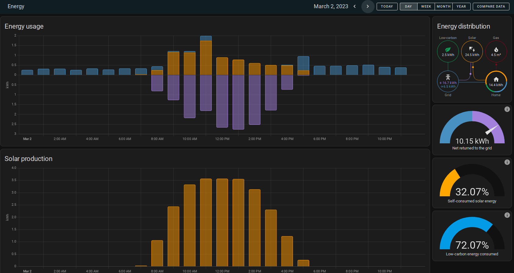
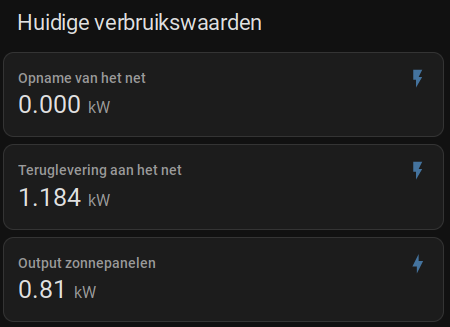

# Envoy Solar Reader

This application will retrieve data from Enlighten Envoy Solar micro inverters connected through an Enlighten Enphase Envoy Gateway.   
The data is then posted to a MQTT topic which can be used in a home automation setup. See below for my setup with Home Assistant

## Supported firmware
It *only* supports gateways with firmware 0.7x or greater (especially in local mode, see below) since the authentication mechanism has changed in comparison
with earlier firmware.

## Modes
The application currently only supports *local* mode which means it connects directly to the gateway in your network
In the future a *cloud* mode will be added which means it will retrieve the date through the [Enlighten API](https://developer-v4.enphase.com)

## What data is retrieved
Currently only the daily produced energy (in kWh) and the current power output (in W) for the whole array of inverters is returned.
In the future data for each individual inverter will also be retrieved.


## System requirements
- A Linux installation (sorry, Windows isn't supported (yet))
- Python 3.9+ + tooling (pip, virtualenv)


## Quick start
- Checkout this repository and create a *config.yaml* file with your desired settings (see *config_example.yaml* for the possible settings
and their descriptions)
- Make *create_venv.sh* and *run.sh* executable by executing `chmod +x <filename>`
- Execute `./create_venv.sh` to create a Python virtual environment with all the required dependencies installed
- Execute `./run.sh` to start the application. It starts default in *local* mode.
- The data is now retrieved every interval as specified in the config and posted to a MQTT topic *envoy/production*

## Command line options
```
usage: core.py [-h] [--config CONFIG] [--mode {local,cloud}] [--loglevel {DEBUG,INFO,WARNING,ERROR,CRITICAL}]

options:
  -h, --help            show this help message and exit
  --config CONFIG       Full path to config file. If left empty, program will try to load config.yaml from the current directory
  --mode {local,cloud}  Use api on local device or use cloud based api
  --loglevel {DEBUG,INFO,WARNING,ERROR,CRITICAL}
                        Minimum loglevel

```


## Example setup for HomeAssistant
This is how my setup with Home Assistant works:
- In Home Assistant install the MQTT integration, so that there is a MQTT broker active on the HA instance.
- Install the Envoy Solar Reader on a separate device in your network (i had a spare Raspberry Pi lying around) and (optionally) create
  a systemd service to start the application when booting the device 
- Contents of *config.yaml*:
```yaml
mqtt:
  host: <homeassistant host/ip>
  port: 1883
  username: homeassistant
  password: <mqtt broker password>
  report_interval_seconds: 300

local:
  envoy_host: <ip of envoy gateway>
  envoy_user: <enphase username>
  envoy_password: <enphase password>
  envoy_serial: <envoy gateway serialnumber>
  ```
- Create a  sensor definition in HA as follows:

```yaml
mqtt:
  sensor:
    - name: "Solar energy produced today"
      state_class: total_increasing         # IMPORTANT IF YOU WANT TO USE THIS IN THE ENERGY DASHBOARD
      device_class: energy                  # IMPORTANT IF YOU WANT TO USE THIS IN THE ENERGY DASHBOARD
      state_topic: envoy/production
      unit_of_measurement: "kWh"
      value_template: "{{ value_json.energyProducedTodayInKwh }}"
      last_reset_value_template: "1970-01-01T00:00:00+00:00"
      expire_after: 600
    
    - name: "Current total solar power"
      state_class: measurement
      device_class: energy
      state_topic: envoy/production
      unit_of_measurement: "kW"
      value_template: "{{ value_json.currentTotalPowerInWatts |float / 1000 }}"
      expire_after: 600

```
- Configure the energy dashboard with the `Solar energy produced today` sensor.
- Put the `Current total solar power` on a dashboard  

Some screenshots:

  




### Systemd service
TODO


